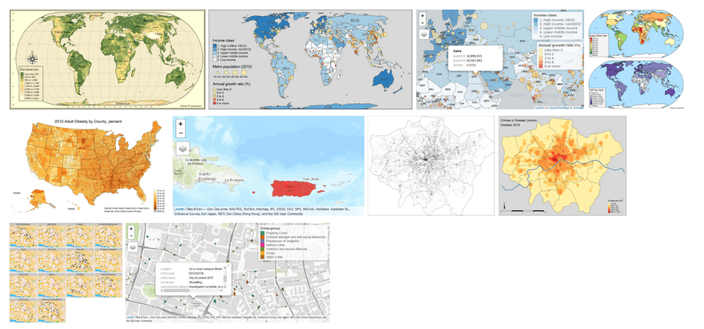

class: inverse, left, nonum, clear
background-image: url("figs/cover.jpg")
background-size: cover

.titlestyle[Introduction] 
<br>
.titlestyle[to]
<br>
.titlestyle[landscape]
<br>
.titlestyle[ecology]
<br>
.titlestyle[with R]


<link rel="stylesheet" type="text/css" href="//fonts.googleapis.com/css?family=Lora" />

.captionstyle[Jakub Nowosad and Maximilian H.K. Hesselbarth]

.captionstyle[2020-05-14, the IALE-North America 2020 Annual Meeting]


<!-- https://www.si.edu/object/bright-scene-cattle-near-stream:saam_1983.104.2 -->

```{r setup, echo  = FALSE, results = "hide", message = FALSE, warning = FALSE}
library(dplyr)
library(extrafont)
library(ggplot2)
library(gganimate)
library(knitr)
library(landscapemetrics)
library(purrr)
library(raster)
library(sp)

knitr::opts_chunk$set(warning = FALSE, message = FALSE, fig.align = "center")
extrafont::fonts()
options(tibble.print_min = 5)
options(tibble.print_max = 5)
```

---
# Prerequisites

.pull-left[
You can install the packages used in the workshop as follows:

```{r, eval=FALSE}
pkgs <- c(
  "sf",                
  "raster",            
  "tmap",              
  "landscapemetrics",
  "usethis"
)
install.packages(pkgs)
```
]

.pull-right[
The code below can be used to download all the scripts and data for the workshop:

```{r, eval=FALSE}
usethis::use_course(ADD LINK)
```
]

---
# ...

- rules 
- workshop agenda

---
class: inverse, left, bottom, clear, nonum

layout: false

background-image: url("figs/geocompr-logo.png")
background-position: 85% 10%
background-size: 30%

# Part I

## Introduction to the spatial data analysis in R

Jakub Nowosad

Institute of Geoecology and Geoinformation, Adam Mickiewicz University, Poznan, Poland

---
# Spatial data representations: raster data

.lc[
- The **raster** package
- Classes for spatial raster data: `RasterLayer`, and multilayer `RasterStack` and `RasterBrick`
- Raster data input/output
- Raster algebra and raster processing
- ?`raster-package`, [link1](https://geocompr.robinlovelace.net/spatial-class.html#raster-data), [link2](https://rspatial.org/raster/index.html), and [link3](http://www.rpubs.com/etiennebr/visualraster)
]

.rc[
```{r, echo=FALSE, out.height=200}
knitr::include_graphics("figs/raster-intro-plot-1.png", dpi = NA)
```

```{r, message=FALSE}
library(raster)
elev_data <- raster("data/example_elevation.tif")
elev_data
```
]


---
# Spatial data representations: vector data

.pull-left[
```{r,echo=FALSE, message=FALSE}
library(spData)
library(sf)
library(tmap)
study_area <- read_sf("data/study_area.gpkg")
tmap_mode("view")
tm_shape(study_area) + 
    tm_borders()
tmap_mode("plot")
```

]

.pull-right[

```{r}
library(sf)
study_area <- read_sf("data/study_area.gpkg")
head(study_area)
```

- The **sf** package
- A class system for spatial vector data 
- Vector data input/output
- Transformations between different coordinate reference systems (CRS)
- Geometric operations
- [link1](https://geocompr.robinlovelace.net/spatial-class.html#vector-data), [link2](https://r-spatial.github.io/sf/), [link3](https://github.com/rstudio/cheatsheets/blob/master/sf.pdf)
]


---
# Spatial data reading

.pull-left[
<!-- https://www.mrlc.gov/data/legends/national-land-cover-database-2011-nlcd2011-legend -->

```{r, echo=FALSE, eval=FALSE}
library(dplyr)
library(tidyr)
lc_df = tibble::tribble(
                                 ~V1,
                    "11. Open Water",
            "12. Perennial Ice Snow",
         "21. Developed, Open Space",
      "22. Developed, Low Intensity",
   "23. Developed, Medium Intensity",
      "24. Developed High Intensity",
           "31. Bare Rock/Sand/Clay",
              "41. Deciduous Forest",
              "42. Evergreen Forest",
                  "43. Mixed Forest",
                   "51. Dwarf Shrub",
                   "52. Shrub/Scrub",
         "71. Grasslands/Herbaceous",
              "72. Sedge/Herbaceous",
                          "74. Moss",
                   "81. Pasture/Hay",
              "82. Cultivated Crops",
                "90. Woody Wetlands",
  "95. Emergent Herbaceous Wetlands"
  ) %>% separate(V1, c("ID", "lc_category"), sep = "\\.") %>% 
  mutate(ID = as.integer(ID), 
         lc_category = stringr::str_trim(lc_category))
```


```{r, echo=FALSE, eval=FALSE}
library(raster)
lc_data <- raster("data/example_landscape.tif") 
levels(lc_data)[[1]] <- levels(lc_data)[[1]] %>% 
  left_join(lc_df, by = "ID") %>% 
  dplyr::select(-category)
levels(lc_data)[[1]] <- na.omit(levels(lc_data)[[1]])

writeRaster(lc_data, "data/example_landscape33.tif", options = "COMPRESS=DEFLATE")
```

```{r}
library(sf)
library(raster)
study_area <- read_sf("data/study_area.gpkg")
lc_data <- raster("data/example_landscape.tif") 
```

```{r, echo=FALSE, eval=FALSE}
library(elevatr)
elev_data <- elevatr::get_elev_raster(extend(lc_data, y = c(100, 100)), z = 11)
elev_data <- resample(elev_data, lc_data, method = "bilinear")
elev_data2 <- projectRaster(elev_data, crs = "+proj=longlat +datum=WGS84 +no_defs")
elev_data3 <- projectRaster(elev_data2, crs = lc_data)
writeRaster(elev_data2, "data/example_elevation.tif", options = "COMPRESS=DEFLATE", overwrite = TRUE)
```
]

.pull-right[
```{r}
plot(lc_data, axes = TRUE)
plot(st_geometry(study_area), add = TRUE)
```

```{r, echo=FALSE, eval=FALSE}
aa = mapedit::drawFeatures(mapview::mapview(sf::st_bbox(lc_data)))
bb = sf::st_transform(aa, sf::st_crs(lc_data))
bb$X_leaflet_id = NULL
bb$feature_type = NULL
bb$id = 1
st_crs(bb) = st_crs(bb)
write_sf(bb, "data/study_area.gpkg")
```


]


---
# Making maps in R: tmap

```{r}
library(tmap)
```

- Thematic mapping package
- It allows you to create static maps, animated maps and interactive maps.
- It works by adding subsequent layers to visualize and then modifying them.
- https://github.com/mtennekes/tmap - list of additional materials about the **tmap** package 

```{r, echo=FALSE, out.width="75%"}

```

---
class: left, middle, clear, nonum

##  First practical part

Try to work through *Exercise_1_1.R*. 
The exercises will throw you in at the deep end - **you need to modify the provided code to improve the resulting map**.

During the exercise there are part where you are supposed to type your own solution indicated by the following structure:

```{r exercise_code_1_1, eval = FALSE}
# /Start Code/ #

print("Hello World") # This would be your code contribution

# /End Code/ # 
```

In case you run into problems or have any questions, please contact us at any time via *Zoom* private chat. 

---
# Making maps in R

.left-code[
```{r tm1, fig.show="hide", error=TRUE}
tm_shape(study_area) #<<
```
]

.right-plot[
`)
]

---
# Making maps in R

.left-code[
```{r tm2, fig.show="hide", fig.width=8}
tm_shape(study_area) +
  tm_borders() #<<
```
]

.right-plot[
`)
]

---
# Making maps in R

.left-code[
```{r tm3, fig.show="hide", fig.width=8}
tm_shape(study_area) +
  tm_borders() +
  tm_scale_bar(position = c("right",      #<<
                            "bottom")) +  #<<
  tm_compass(position = c("left", "top")) #<<
```
]

.right-plot[
`)
]

---
# Making maps in R

.left-code[
```{r tm4, fig.show="hide", fig.width=8}
tm_shape(study_area) +
  tm_borders() +
  tm_scale_bar(position = c("right",      
                            "bottom")) +  
  tm_compass(position = c("left", "top")) +
  tm_layout(main.title = "Study area") #<<
```
]

.right-plot[
`)
]

---
# Making maps in R

```{r, eval=FALSE}
tmap_mode("view") #<<
tm_shape(study_area) +
  tm_borders() +
  tm_layout(main.title = "Study area")
```

```{r,eval=FALSE}
tmap_mode("plot") #<<
tm_shape(study_area) +
  tm_borders() +
  tm_layout(main.title = "Study area")
```


---
# Making maps in R

.left-code[
```{r tm5, fig.show="hide", fig.width=8}
tm_shape(lc_data) + #<<
  tm_raster()       #<<
```
]

.right-plot[
`)
]

---
# Making maps in R

.left-code[
```{r tm6, fig.show="hide", fig.width=8}
tm_shape(lc_data) + 
  tm_raster() +
  tm_layout(legend.outside = TRUE) #<<
```
]

.right-plot[
`)
]

---
# Making maps in R

.left-code[
```{r tm7, fig.show="hide", fig.width=8}
tm_shape(lc_data) + 
  tm_raster(drop.levels = TRUE,       #<<
            title = "Land cover:") +  #<<
  tm_layout(legend.outside = TRUE)   
```
]

.right-plot[
`)
]

---
# Making maps in R

.left-code[
```{r tm8, fig.show="hide", fig.width=8}
tm_shape(lc_data) + 
  tm_raster(drop.levels = TRUE,       
            title = "Land cover:") +  
  tm_shape(study_area) + #<<
  tm_borders() + #<<
  tm_scale_bar(position = c("right",      #<<
                            "bottom")) +  #<<
  tm_compass(position = c("left", "top")) + #<<
  tm_layout(main.title = "Study area", #<<
            legend.outside = TRUE)  
```
]

.right-plot[
`)
]

---
# Making maps in R

.left-code[
```{r tm9, fig.show="hide", fig.width=8}
tm_shape(lc_data) + 
  tm_raster(drop.levels = TRUE,       
            title = "Land cover:") +  
  tm_shape(study_area) +
  tm_borders(lwd = 3, col = "black") +  #<<
  tm_scale_bar(position = c("right",      
                            "bottom")) +  
  tm_compass(position = c("left", "top")) +
  tm_layout(main.title = "Study area",
            legend.outside = TRUE)  
```
]

.right-plot[
`)
]


---
# Making maps in R

```{r}
elev_data <- raster("data/example_elevation.tif")
```

.left-code[
```{r tm10, fig.show="hide", fig.width=8}
tm_shape(elev_data) +  #<<
  tm_raster()  #<<
```
]

.right-plot[
`)
]

---
# Making maps in R

.left-code[
```{r tm11, fig.show="hide", fig.width=8}
tm_shape(elev_data) + 
  tm_raster(style = "cont",  #<<
            title = "Elevation (m asl)") +  #<<
  tm_layout(legend.outside = TRUE)  #<<
```
]

.right-plot[
`)
]

---
# Making maps in R

.left-code[
```{r tm12, fig.show="hide", fig.width=8}
tm_shape(elev_data) + 
  tm_raster(style = "cont",
            title = "Elevation (m asl)",
            palette = "-RdYlGn") +  #<<
  tm_layout(legend.outside = TRUE)

# tmaptools::palette_explorer()
```
]

.right-plot[
`)
]

---
# Making maps in R

.left-code[
```{r tm13, fig.show="hide", fig.width=8, eval=FALSE}
map1 <- tm_shape(elev_data) + 
  tm_raster(style = "cont",
            title = "Elevation (m asl)",
            palette = "-RdYlGn") +
  tm_layout(legend.outside = TRUE)

tmap_save(map1, "my_first_map.png")  #<<

tmap_save(map1, "my_first_map.html")  #<<
```
]

.right-plot[
`)
]

---
# R spatial processing power

.pull-left[
Attribute data operations:
- Vector attribute subsetting, aggregation and joins
- Creating new vector attributes
- Raster subsetting
- Summarizing raster objects

Spatial data operations:
- Spatial subsetting
- Topological relations
- Spatial joining
- Aggregation
- Map algebra
- Local, focal, and zonal raster operations
]

.pull-right[
Geometry operations:
- Geometric operations on vector data
- Geometric operations on raster data
- **Vector-raster interactions**

Coordinate reference systems:
- Understanding map projections
- **Reprojecting spatial data**
- Modifying map projections
]


---
# Vector-raster interactions: crop

.lc[
```{r, eval=FALSE}
lc_data
```
```{r, echo=FALSE}
tm_shape(lc_data) +
  tm_raster() +
  tm_shape(study_area) + 
  tm_borders(lwd = 3, col = "black") +
  tm_layout(legend.show = FALSE)
```

]

.rc[
```{r}
lc_data_cropped = crop(lc_data, study_area)
```
```{r, echo=FALSE, fig.width=8}
tm_shape(lc_data_cropped) +
  tm_raster() +
  tm_shape(study_area) + 
  tm_borders(lwd = 3, col = "black") +
  tm_layout(legend.show = FALSE)
```
]

---
# Vector-raster interactions: mask

.lc[
```{r, eval=FALSE}
lc_data
```
```{r, echo=FALSE}
tm_shape(lc_data) +
  tm_raster() +
  tm_shape(study_area) + 
  tm_borders(lwd = 3, col = "black") +
  tm_layout(legend.show = FALSE)
```

]

.rc[
```{r}
# lc_data_masked = mask(crop(lc_data, study_area), study_area)
lc_data_masked = mask(lc_data_cropped, study_area)
```
```{r, echo=FALSE, fig.width=8}
tm_shape(lc_data_masked) +
  tm_raster() +
  tm_shape(study_area) + 
  tm_borders(lwd = 3, col = "black") +
  tm_layout(legend.show = FALSE)
```
]


---
# Spatial data coordinates

```{r, echo=FALSE}
polygon_sfc = st_sfc(st_polygon(list(rbind(
  c(1.2, 0.6), c(1.4, 0.6), c(1.4, 0.8), c(1.2, 0.8), c(1.2, 0.6)
))), crs = 4326)
polygon_sf = st_sf(geometry = polygon_sfc)
```

- **Geographic coordinates**: angles (degrees; longitude and latitude), pointing out locations on a spherical or ellipsoidal surface
- **Projected coordinates**: measured on a two-dimensional flat space (e.g. in metres; x and y), related to an ellipsoid by projection

.pull-left[
```{r, warning=FALSE, purl=FALSE, echo=FALSE, fig.height=6}
library(tmap)
library(sf)
polygon_sf$id = as.factor(c(1))
polygon_sf_af = polygon_sf
polygon_sf_af$geometry = polygon_sf_af$geometry + c(20, 40)
polygon_sf_afp = st_cast(polygon_sf_af, "MULTIPOINT")
tm_shape(polygon_sf_af) +
  tm_graticules() + 
  tm_polygons(col = "id", lwd = 7) +
  tm_shape(polygon_sf_afp) +
  tm_dots(size = 1) +
  tm_layout(main.title = "POLYGON", legend.show = FALSE, inner.margins = 0.15) +
  tm_xlab("Longitude", space = 0.5) + 
  tm_ylab("Latitude", space = 0.5)
```
]

.pull-right[
```{r, purl=FALSE, echo=FALSE, warning=FALSE, fig.height=6}
library(tmap)
polygon_sf_p = st_cast(polygon_sf, "MULTIPOINT")
tm_shape(polygon_sf) +
  tm_grid() + 
  tm_polygons(col = "id", lwd = 7) +
  tm_shape(polygon_sf_p) +
  tm_dots(size = 1) +
  tm_layout(main.title = "POLYGON", legend.show = FALSE, inner.margins = 0.15) +
  tm_xlab("X", space = 0.5) + 
  tm_ylab("Y", space = 0.5)
```
]


---
# Coordinate reference systems

.pull-left[
```{r}
st_crs(study_area)
```
]

.pull-right[
```{r}
crs(lc_data)
```
]

---
# Reprojecting spatial data

.pull-left[
- [A vast topic](https://geocompr.robinlovelace.net/reproj-geo-data.html#when-to-reproject)
- **Geographic Coordinate Reference Systems:** data integration, web mapping. Usually WGS84 (EPSG: 4326)
- **Projected Coordinate Reference Systems:** data analysis, local maps. Often some CRS is already used in the project/by the institution
- You can find different CRSs and their representations at https://epsg.io/

**Vector data:**
1. `study_area2 = st_transform(study_area, st_crs(another_sf_obj))`
1. `study_area2 = st_transform(study_area, crs(lc_data))`
1. `study_area2 = st_transform(study_area, 4326)`
1. `study_area2 = st_transform(study_area, "ESRI:54030")`
]


--


.pull-right[
**Raster data:**
1. `elev_data2 = projectRaster(elev_data, crs = "+proj=longlat +datum=WGS84 +no_defs")`
1. `elev_data2 = projectRaster(elev_data, crs = lc_data)`
1. `elev_data2 = projectRaster(elev_data, crs = st_crs(study_area)$proj4string)`

Method is important here:
1. `elev_data2 = projectRaster(elev_data, crs = "+proj=longlat +datum=WGS84 +no_defs", method = "bilinear")`
1. `lc_data2 = projectRaster(lc_data, crs = "+proj=longlat +datum=WGS84 +no_defs", method = "ngb")`
]

---
# Reprojecting spatial data

<!-- ?resample -->

.pull-left[
```{r, eval=FALSE}
elev_data
```
<br>
<br>
```{r, echo=FALSE, fig.width=8}
tm_shape(elev_data) + 
  tm_raster(style = "cont",
            title = "Elevation (m asl)",
            palette = "-RdYlGn") +
  tm_layout(legend.show = FALSE) + 
  tm_graticules()
```


]

.pull-right[
```{r}
elev_data2 <- projectRaster(elev_data, 
                            crs = lc_data, 
                            method = "bilinear")
```
```{r, echo=FALSE, fig.width=8}
tm_shape(elev_data2) + 
  tm_raster(style = "cont",
            title = "Elevation (m asl)",
            palette = "-RdYlGn") +
  tm_layout(legend.show = FALSE) + 
  tm_grid()
```


]

---
class: left, middle, clear, nonum

##  Second practical part

Try to work through *Exercise_1_2.R*. 
The exercises will focus on understanding spatial data, interactions between raster and vector representation, and reprojecting spatial objects. 

During the exercise there are part where you are supposed to type your own solution indicated by the following structure:

```{r exercise_code_1_2, eval = FALSE}
# /Start Code/ #

print("Hello World") # This would be your code contribution

# /End Code/ # 
```

In case you run into problems or have any questions, please contact us at any time via *Zoom* private chat. 

---
# Summary

<!-- add something about r spatial ecosystem?? -->

.lc[
<a href="https://geocompr.robinlovelace.net/">
```{r, echo=FALSE, out.width="100%"}
knitr::include_graphics("figs/book_cover.jpg")
```
</a>
]

.rc[
Recent talks:
- "The landscape of spatial data analysis in R": [video](https://www.youtube.com/watch?v=bLgoqnqJ4DY) and [slides](https://nowosad.github.io/whyr_19)
- "Recent changes in R spatial and how to be ready for them": [video](https://www.youtube.com/watch?v=Va0STgco7-4) and [slides](https://nowosad.github.io/whyr_webinar004)

Resources:

- [The Geocomputation with R website](https://geocompr.github.io/): open source book, blog posts, workshop materials, and more
- [The Spatial Data Science with R website (focus on raster)](https://www.rspatial.org/): materials focused on the **raster** package
- [The r-spatial website](https://www.r-spatial.org/): blog posts and a book-in-progress
- [The GIS Stackexchange website](https://gis.stackexchange.com/questions/tagged/r): place to ask questions related to spatial data analysis in R
- `#rspatial` and `#geocompr` on Twitter
]


---
class: inverse, left, bottom, clear, nonum

# Break (30 minutes)

---
# Break (30 minutes)

<!--We could ask for questions during the intro, and then during the break, we could look at them and prepare our answers.-->
<!--we should use some online timer (or rmarkdown timer), visible to the participants-->